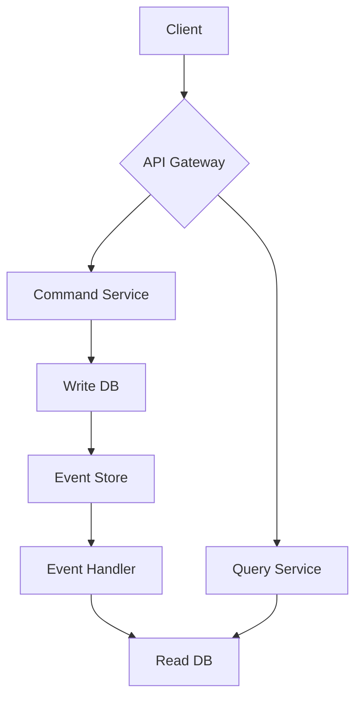

# CQRS (Command Query Responsibility Segregation)

## 정의
CQRS는 애플리케이션의 명령(Command)과 쿼리(Query)를 분리하는 아키텍처 패턴입니다.
- 명령 모델: 시스템의 상태를 변경하는 작업을 담당하는 모델입니다. 일반적으로 도메인 모델과 함께 사용됩니다.
- 쿼리 모델: 시스템의 상태를 읽는 작업을 담당. 일반적으로 읽기 전용 뷰 모델과 함께 사용됩니다.
## 구현 방식
1. 단일 데이터베이스 CQRS
- 가장 간단한 형태로, 하나의 데이터베이스를 사용하지만 읽기와 쓰기 작업을 위한 별도의 객체 모델을 유지합니다.
2. 분리된 데이터베이스 CQRS
- 읽기와 쓰기 작업에 대해 별도의 데이터베이스를 사용합니다. 이 방식은 각 작어벵 최적화된 데이터 모델과 쿼리를 사용할 수 있게 해줍니다.
## CQRS의 장단점
- 장점
  - 성능 최적화: 읽기와 쓰기 작업을 독립적으로 확장할 수 있어, 각 작업의 특서에 맞는 최적화가 가능합니다.
  - 복잡성 관리: 복잡한 도메인 로직을 명령 모델에 집중시키고, 쿼리 모델은 단순화 할 수 있습니다.
  - 유연성: 읽기와 쓰기 모델을 독립적으로 발전시킬 수 있어, 시스템읭 유연성이 향상됩니다.
  - 보안: 명령과 쿼리를 분리함으로써, 각 작업에 대한 보안 정책을 더 세밀하게 적용할 수 있스빈다.
- 단점
  - 복잡성 증가: 두 개의 모델을 관리해야 하므로 초기 개발 복잡도가 증가할 수 있스빈다.
  - 데이터 일관성: 명령 모델과 쿼리 모델 간의 데이터 동기화가 필요하며, 이는 시스템 복잡성을 더합니다.
  - 학습 곡선
## Event Sourcing 데이터의 일관성 해결하기
CQRS는 단일 데이터 모델에서도 구현이 가능하지만 분리된 데이터베이스에서 구현도 가능합니다.<br>
분리된 데이터베이스로 구현하는 이유는 다음과 같습니다.
- 읽기와 쓰기 작업의 성능 요구사항이 다를 수 있다습니다.
- 복잡한 도메인 모델과 최적화된 읽기 모델을 별로도로 관리할 수 있습니다.

이렇게 되면 생기는 문제가 db가 분리됨에 따라 오는 데이서 일관선 문제입니다. 이를 해결하기 위해 Event Sourcing을 사용할 수 있습니다.<br>

1. 구현 방식
- Write DB: 정규화된 스키마, 트랜잭션 일관성에 중점
- Read DB: 비정규화된 스키마, 쿼리 성능에 최적화
2. 동기화 메커니즘
- 이벤트 소싱: Write DB의 변경사항을 이벤트로 발생
- 이벤트 핸들러: 이벤트를 구독하여 Read DB를 업데이트

이렇게 구성하게 되면 다음과 같은 장점을 얻을 수 있습니다.
- 장점
  - 성능 최적화: 읽기와 쓰기 작업을 각각 최적화 할 수 있습니다.
  - 확장성: 읽기와 쓰기 부하를 독립적으로 확장할 수 있습니다.
  - 유연성: 복잡한 도메인 모델과 간단한 읽기 모델을 분리할 수 있습니다.
- 단점
  - 복잡성 증가: 두 개의 데이터 저장소를 관리해야 합니다.
  - 일관성 지연: 읽기 DB가 쓰기 DB와 즉시 동기화되지 않을 수 있습니다.
  - 개발 및 운영 비용 증가: 인프라와 코드가 더 많이 필요합니다.

실제 구현시 어떤 점을 고려해야 할까요?
1. 동기화 전략: 실시간 동기화가 필요한지, 배치 처리로 충분한지 결정해야 합니다.
2. 일관성 수준: 비즈니스 요구사항에 따라 허용 가능한 일관성 지연을 정의해야 합니다.
3. 장애 처리: 동기화 실패 시의 복구 전략을 마련해야 합니다.
4. 모니터링: 두 DB간의 불일치를 감안하고 해결하는 매커니즘이 필요합니다.

### 데이터의 일관성 지연 어떻게 대응할 수 있을까
1. 동기화 전략
- 실시간 동기화
  - 이벤트 스트리밍 플랫폼을 사용해 실시간 동기화(예: Apache Kafka, AWS Kinesis..)
    - 플랫폼 장애시 어떻게 대응할까?
      - 고가용성 구성
        - 클러스터를 여러 브로커로 구성하여 일부 노드 장애 시에도 작동하도록 합니다.
        - Zookeeper 앙상블을 사용하여 Kafka 클러스터 관리의 안정성을 높입니다.
      - 로컬 큐잉
        - Kafka에 메시지를 보내기 전에 로컬 큐에 임시 저장합니다.
        - Kafka 복구 시 로컬 큐의 메시지를 재전송합니다.
      - 듀얼 라이팅
        - 주요 데이터 변경 시 Write DB와 Read DB에 동시 쓰기를 수행하빈다.
        - Kafka는 백그라운드 동기화용으로 사용하여 일시적 불일치를 해결합니다.
  - 변경 데이터 캡처(CDC) 도구 활용(예: Debezium)
    - CDC는 데이터베이스 변경 사항을 실시간으로 캡처하고 다른 시스템으로 전파하는 프로세스입니다.
    - 특징
      - 데이터베이스 로그를 읽어 변경 사항을 추적합니다.
      - 최소한의 오버헤드로 실시간 데이터 동기화를 가능하게 합니다.
      - Debezium과 같은 도구를 사용하여 구현할 수 있습니다.
```java
// KafkaProducerConfig.java
@Configuration
public class KafkaProducerConfig {
    @Bean
    public ProducerFactory<String, String> producerFactory() {
        Map<String, Object> configProps = new HashMap<>();
        configProps.put(ProducerConfig.BOOTSTRAP_SERVERS_CONFIG, "localhost:9092");
        configProps.put(ProducerConfig.KEY_SERIALIZER_CLASS_CONFIG, StringSerializer.class);
        configProps.put(ProducerConfig.VALUE_SERIALIZER_CLASS_CONFIG, StringSerializer.class);
        return new DefaultKafkaProducerFactory<>(configProps);
    }

    @Bean
    public KafkaTemplate<String, String> kafkaTemplate() {
        return new KafkaTemplate<>(producerFactory());
    }
}

// StoreService.java
@Service
public class StoreService {
    @Autowired
    private KafkaTemplate<String, String> kafkaTemplate;

    @Transactional
    public void updateStore(Store store) {
        // Update Write DB
        storeRepository.save(store);
        
        // Publish event to Kafka
        kafkaTemplate.send("store-updates", store.getId().toString(), new ObjectMapper().writeValueAsString(store));
    }
}

// ReadDbUpdater.java
@Service
public class ReadDbUpdater {
    @Autowired
    private ReadStoreRepository readStoreRepository;

    @KafkaListener(topics = "store-updates", groupId = "read-db-updater")
    public void listenStoreUpdates(String message) {
        Store store = new ObjectMapper().readValue(message, Store.class);
        // Update Read DB
        readStoreRepository.save(store);
    }
}
```
- 배치 동기화
  - 주기적으로 대량의 데이터 동기화를 수행
  - 오프 피크 시간대에 실행하여 시스템 부하를 최소화
2. 일관성 수준
- 일관성 수준 정의
  - 비즈니스 요구사항에 따라 허용 가능한 지연 시간을 설정
  - 중요한 데이터의 경우 동기식 업데이트 고려
- 버전 관리
  - 각 엔티티에 버전 번호 추가
  - 클라이언트에게 데이터의 '신선도' 정보 제공
```java
// Store.java
@Entity
public class Store {
  @Id
  private Long id;
  private String name;
  @Version
  private Long version;
  // other fields...
}

// StoreDTO.java
public class StoreDTO {
  private Long id;
  private String name;
  private Long version;
  private Instant lastUpdated;
  // getters and setters...
}

// StoreService.java
@Service
public class StoreService {
  public StoreDTO getStore(Long id) {
    Store store = storeRepository.findById(id).orElseThrow();
    StoreDTO dto = mapToDTO(store);
    dto.setLastUpdated(Instant.now());
    return dto;
  }
}

// StoreController.java
@RestController
@RequestMapping("/api/stores")
public class StoreController {
  @GetMapping("/{id}")
  public ResponseEntity<StoreDTO> getStore(@PathVariable Long id) {
    StoreDTO store = storeService.getStore(id);
    return ResponseEntity.ok()
            .cacheControl(CacheControl.maxAge(30, TimeUnit.SECONDS))
            .eTag(Long.toString(store.getVersion()))
            .body(store);
  }
}
```
3. 장애 처리
- 재시도 메커니즘
  - 동기화 실패 시 자동 재시도 로직 구현
  - 지수 백오프 전략 사용
- 복구 프로세스
  - 장애 발생 시 수동 또는 자동으로 동기화를 재개하는 프로세스 구축
- 장애 격리
  - Circuit Breaker 패턴을 사용하여 장애 전파 방지
4. 모니터링
- 불일치 감지
  - 주기적으로 write DB와 read DB 비교
  - 불일치 발견 시 알림 발생
- 실시간 모니털이
  - 동기화 지연 시간 모니터링
  - 임계값 초과 시 경고 발생
```java
// pom.xml
<dependency>
    <groupId>org.springframework.boot</groupId>
    <artifactId>spring-boot-starter-actuator</artifactId>
</dependency>

// application.properties
management.endpoints.web.exposure.include=health,metrics,prometheus
management.endpoint.health.show-details=always

// CustomHealthIndicator.java
@Component
public class DatabaseSyncHealthIndicator implements HealthIndicator {
  @Autowired
  private DatabaseSyncService databaseSyncService;

  @Override
  public Health health() {
    long delay = databaseSyncService.getSyncDelay();
    if (delay > 60000) { // 1 minute
      return Health.down().withDetail("sync_delay", delay).build();
    }
    return Health.up().withDetail("sync_delay", delay).build();
  }
}

// MetricsConfig.java
@Configuration
public class MetricsConfig {
  @Bean
  MeterRegistry meterRegistry() {
    return new SimpleMeterRegistry();
  }
}

// DatabaseSyncService.java
@Service
public class DatabaseSyncService {
  private final MeterRegistry meterRegistry;

  public DatabaseSyncService(MeterRegistry meterRegistry) {
    this.meterRegistry = meterRegistry;
  }

  public void recordSyncDelay(long delayMs) {
    meterRegistry.gauge("db.sync.delay", delayMs);
  }
}
```

## 마스터-레플리카와는 비슷하면서도 다르다
### 마스터-레플리카 구조
데이터베이스 복제 전략으로 주로 RDB에서 사용됩니다.
- 특징
  - 마스터 DB: 모든 쓰기 작업과 일부 읽기 작업을 처리
  - 레플리카 DB: 마스터의 복제본으로, 주로 읽기 작업을 처리
  - 동일한 스키마: 마스터와 레플리카가 같은 데이터 구조를 가짐
  - 실시간 복제: 마스터의 변경 사항이 거의 실시간으로 레플리카에 반영됨
```java
// application.properties
spring.datasource.master.jdbc-url=jdbc:mysql://master-db:3306/mydb
spring.datasource.master.username=master_user
spring.datasource.master.password=master_pass

spring.datasource.replica.jdbc-url=jdbc:mysql://replica-db:3306/mydb
spring.datasource.replica.username=replica_user
spring.datasource.replica.password=replica_pass

// DataSourceConfig.java
@Configuration
public class DataSourceConfig {

  @Bean
  @ConfigurationProperties("spring.datasource.master")
  public DataSource masterDataSource() {
    return DataSourceBuilder.create().build();
  }

  @Bean
  @ConfigurationProperties("spring.datasource.replica")
  public DataSource replicaDataSource() {
    return DataSourceBuilder.create().build();
  }

  @Bean
  public DataSource routingDataSource(
          @Qualifier("masterDataSource") DataSource masterDataSource,
          @Qualifier("replicaDataSource") DataSource replicaDataSource) {
    Map<Object, Object> targetDataSources = new HashMap<>();
    targetDataSources.put("master", masterDataSource);
    targetDataSources.put("replica", replicaDataSource);

    RoutingDataSource routingDataSource = new RoutingDataSource();
    routingDataSource.setTargetDataSources(targetDataSources);
    routingDataSource.setDefaultTargetDataSource(masterDataSource);
    return routingDataSource;
  }

  @Bean
  public PlatformTransactionManager transactionManager(
          @Qualifier("routingDataSource") DataSource routingDataSource) {
    return new DataSourceTransactionManager(routingDataSource);
  }
}

// RoutingDataSource.java
public class RoutingDataSource extends AbstractRoutingDataSource {
  @Override
  protected Object determineCurrentLookupKey() {
    return TransactionSynchronizationManager.isCurrentTransactionReadOnly() ? "replica" : "master";
  }
}

// UserService.java
@Service
public class UserService {
  @Autowired
  private UserRepository userRepository;

  @Transactional(readOnly = true)
  public User findById(Long id) {
    return userRepository.findById(id).orElse(null);
  }

  @Transactional
  public User save(User user) {
    return userRepository.save(user);
  }
}
```
### CQRS 패턴
애플리케이션의 명령과 쿼리 작업을 분리하는 아키텍처 패턴입니다.
- 특징
  - 명령 모델: 쓰기 작업을 위한 최적화된 모델
  - 쿼리 모델: 읽기 작업을 위한 최적화된 모델
  - 다른 스키마 가능: 명령 모델과 쿼리 모델이 다른 데이터 구조를 가질 수 있음
  - 비동기 동기화: 명령 모델의 변경사항이 쿼리 모델에 비해 비동기적으로 반영될 수 있음

### 주요 차이점
1. 데이터 모델
   - 마스터-레플리카: 동일 데이터 모델 사용
   - CQRS: 비동기 동기화가 일반적, 일시적인 불일치 허용
2. 동기화
   - 마스터-레플리카: 일반적으로 실시간 또는 준 실시간 동기화
   - CQRS: 비동기 동기화가 일반적, 일시적인 불일치 허용
3. 확장성
   - 마스터-레플리카: 주로 읽기 작업의 확장성 향상
   - CQRS: 일긱와 쓰기 작업 모두의 독립적인 확장성 제공
4. 복잡성
   - 마스터-레플리카: 상대적으로 단순한 구현
   - CQRS: 더 복잡한 아키텍처, 추가적인 동기화 메커니즘 필요
5. 용도
   - 마스터-레플리카: 주로 로드 밸런싱과 고가용성을 위해 사용
   - CRQS: 복잡한 도메인 로직과 고성능 쿼리 요구사항을 분리하기 위해 사용

### 결론
마스터-레플리카 구조는 **동일 데이터** 모델을 사용하면서 읽기 성능을 향상시키는 데 초점을 맞춥니다.
반면 CQRS는 읽기와 쓰기 작업을 완전히 분리하여 각각을 독립적으로 최적화할 수 있게 합니다.

실제 시스템에서는 이 두 가지 접근 방식을 결합하여 사용할 수도 있습니다. 예를들어 CQRS 패턴을 적용하면서 쿼리 
모델 부분에서 마스터-레플리카 구조를 도입하여 읽기 성능을 더욱 향상시킬 수 있습니다.
