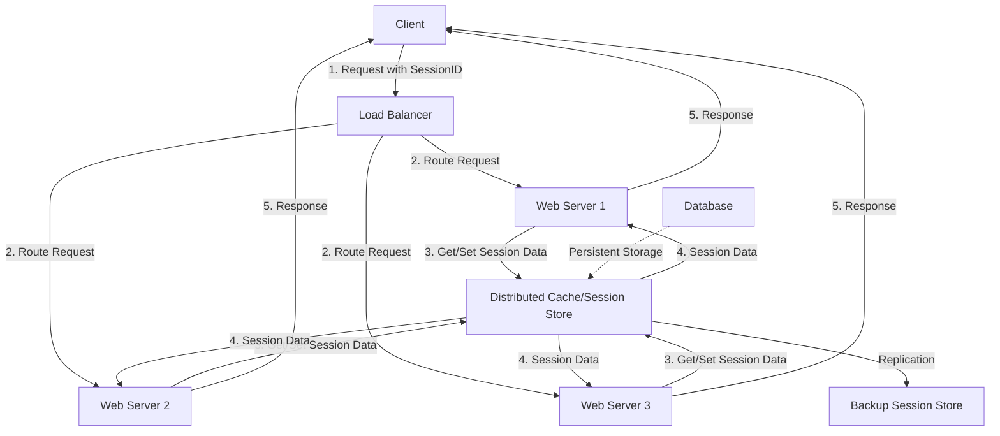

# 쿠키와 세션의 차이에 대해 설명해주세요
1. 저장 위치
   - 쿠키: 클라이언트 측(브라우저)에 저장됩니다.
   - 세션: 서버 측에 저장됩니다. 클라이언트는 세션 ID만 보유합니다.
2. 수명
   - 쿠키: 만료 시간을 설정할 수 있으며, 브라우저 종료 후에도 유지될 수 있습니다.
   - 세션: 일반적으로 브라우저 세션이 종료되면 삭제됩니다.
3. 보안
   - 쿠키: 클라이언트에 저장되므로 사용자가 수정할 수 있습니다. 보안에 취약할 수 있습니다.
   - 세션: 서버에 저장되므로 클라이언트에서 직접 접근할 수 없어 더 안전합니다.
4. 용량
   - 쿠키: 브라우저마다 다르지만 일반적으로 4KB로 제한됩니다.
   - 세션: 서버 측 리소스에 따라 더 많은 데이터를 저장할 수 있습니다.
5. 성능
   - 쿠키: 모든 HTTP 요청에 포함되어 전송되므로 데이터가 많으면 성능에 영향을 줄 수 있습니다.
   - 세션: 서버에서 처리되므로 클라이언트-서버 간 전송되는 데이터양이 적습니다.
6. 사용 목적
   - 쿠키: 사용자 선호 설정, 트래킹 등 지속적인 데이터 저장에 사용됩니다.
   - 세션: 주로 로그인 상태 유지 등 임시적이고 민감한 데이터 관리에 사용됩니다.

쿠키와 세션은 모두 HTTP의 stateless 특성을 보완하기 위해 사용되는 기술이지만, 몇 가지 중요한 차이점이 있습니다.
첫째, 저장 위치가 다릅니다. 쿠키는 클라이언트 측 브라우저에 저장되는 반면, 세션 데이터는 서버 측에 저장됩니다. 이로 인해 세션이 보안 면에서 더 안전합니다.
둘째, 숨여과 지속성에 차이가 있습니다. 쿠키는 만료 시간을 설정할 수 있어 브라우저 종료 후에도 유지될 수 있지만, 세션은 일반적으로 브라우저 세션이 종료되면 삭제됩니다.
셋째, 저장 용량에 차이가 있습니다. 쿠키는 대체로 4KB로 제한되지만, 세션은 서버 리소스에 따라 더 많은 데이터를 저장할 수 있습니다.
넷째, 성능 측면에서 쿠키는 모든 HTTP 요청에 포함되어 전송되므로 데이터가 많으면 네트워크 부하가 증가할 수 있습니다. 반면 세션은 서버에서 처리되므로 이러한 부하가 적습니다.
마지막으로, 사용 목적에 차이가 있습니다. 쿠키는 주로 사용자 선호 설정이나 트래킹 등에 사용되고, 세션은 주로 로그인 상태 유지와 같은 임시적이고 민감한 데이터 관리에 사용됩니다.

## 세션 방식의 로그인 과정에 대해 설명해 주세요.
1. 사용자 인증 요청
   - 사용자가 로그인 폼에 credentials(보통 사용자명과 비밀번호)를 입력하고 제출합니다.
   - 이 정보는 보안을 위해 HTTPS를 통해 서버로 전송됩니다.
2. 서버 측 인증
   - 서버는 받은 credentials를 검증합니다. 일반적으로 비밀번호는 해시 형태로 저장되어 있으므로, 입력된 비밀번호를 해시하여 저장된 값과 비교합니다.
3. 세션 생성
   - 인증이 성공하면, 서버는 고유한 세션 ID를 생성합니다. 이는 보통 암호학적으로 안전한 난수 생성기를 사용합니다.
   - 서버는 이 세션 ID와 관련된 사용자 정보(사용자 ID, 권한 등)를 서버의 메모리나 데이터베이스에 저장합니다.
4. 세션 ID 전송
   - 서버는 생성된 세션 ID를 클라이언트에게 전송합니다.
   - 이는 주로 Set-Cookie HTTP 헤더를 통해 이루어집니다.
5. 클라이언트 저장
   - 브라우저는 받은 세션 ID를 쿠키에 저장합니다.
6. 후속 요청
   - 이후 사용자가 보내느 모든 요청에 브라우저는 자동으로 세션 ID를 보함시킵니다.
   - 이는 Cookie HTTP 헤더를 통해 이루어집니다.
7. 서버의 세션 확인
   - 서버는 각 요청마다 전송된 세션 ID를 확인하고, 해당 세션의 정보를 조회하여 사용자를 식별합니다.
8. 세션 만료
   - 보안을 위해 세션은 일정 시간 후 만료되도록 설정됩니다.
   - 사용자가 로그아웃하면 서버에서 해당 세션을 즉시 삭제합니다.

세션 방식의 로그인 과정은 다음과 같이 진행됩니다.

먼저, 사용자가 로그인 정보를 입력하여 서버에 전송합니다. 
서버는 이 정보를 검증하고, 유효할 경우 고유 세션 ID를 생성합니다. 이 세션 ID는 서버의 메모리나 데이터베이스에 사용자 정보와 함께 저장됩니다.

그 다음, 서버는 이 세션 ID를 클라이언트에게 쿠키의 형태로 전송합니다. 브라우저는 이 쿠키를 저장하고, 이후의 모든 요청에 자동으로 이 세션ID를 포함시킵니다.

서버는 각 요청마다 전송된 세션 ID를 확인하여 사용자를 식별합니다. 이를 통해 로그인 상태를 유지할 수 있습니다.

보안을 위해 세션은 일정 시간 후 만료되도록 설정되며, 사용자가 로그아웃하면 해당 세션은 서버에서 즉시 삭제됩니다

이 방식의 장점은 서버 측에서 세션을 관리하므로 보안성이 높다는 것입니다. 단점으로는 서버에 부하가 갈 수 있고, 분산 환경에서는 세션 관리에 추가적인 고려사항이 필요하다는 점입니다.
### 세션 하이재킹 방지 방법
### 세션 ID의 안전한 생성 방법
## HTTP의 특성인 Stateless에 대해 설명해 주세요.
1. stateless의 정의
   - HTTP는 기본적으로 상태를 저장하지 않는 프로토콜입니다.
   - 각각의 요청은 독립적이며, 서버는 이전 요청에 대한 정보를 보존하지 않습니다.
2. 요청의 독립성
   - 모든 HTTP 요청은 이전 요청과 완전히 독립적으로 처리됩니다
   - 서버는 각 요청을 새로운 요청으로 간주하며, 이전 요청의 컨텍스트를 고려하지 않습니다.
3. 서버 부하 감소
   - 서버가 클라이언트의 상태를 유지할 필요가 없으므로, 리소스 사용이 효율적입니다.
   - 이는 서버 확장성을 향상시킵니다.
4. 단순성
   - Stateless 특성으로 인해 HTTP 프로토콜의 구현이 단순해집니다.
   - 서버는 각 요청을 독립적으로 처리하면 되므로, 복잡한 상태 관리 로직이 필요 없습니다.
5. 신뢰성
   - 각 요청이 독립적이므로, 한 요청의 실패가 다른 요청에 영향을 미치지 않습니다.
6. 캐싱 용이성
   - Stateless 특성은 HTTP 응답의 캐싱을 용이하게 만듭니다.
7. 제약사항
   - 사용자 세션과 같은 상태 유지가 필요한 경우, 추가적인 메커니즘(쿠키, 세션 등)이 필요합니다.

HTTP의 Stateless 특성은 웹의 기본 아키텍처를 정의하는 핵심 개념 중 하나입니다. 이는 각각의 HTTP 요청이 이전 요청과 완전히 독립적으로 처리된다는 것을 의미합니다.

구체적으로 서버는 클라이언트의 이전 요청에 대한 정보를 저장하지 않습니다. 모든 요청은 그 자체로 완전해야 하며, 서버는 각 요청을 새로운 요청으로 간주합니다.

이렇나 Stateless 특성은 몇 가지 중요한 이점을 제공합니다.
첫째, 서버의 확장성을 향상시킵니다. 서버가 클라이언트의 상태를 유지할 필가 없으므로, 리소스 사용이 효율적이고 더 많은 클라이언트 요청을 처리할 수 있습니다.
둘째, 구현이 단순해집니다. 서버는 각 요청을 독립적으로 처리하면 되므로, 복잡한 상태 관리 로직이 필요 없습니다.
셋째, 신뢰성이 높아집니다. 각 요청이 독립적이므로, 한 요청의 실패가 다른 요청에 영향을 미치지 않습니다.
마지막으로 HTTP 응답의 캐싱이 용이해집니다.

그러나 이 특성으로 인해 사용자 세션과 같은 상태 유지가 필요한 경우, 쿠키나 세션과 같은 추가적인 메커니즘을 사용해야 합니다.
### RESTful API 설계
### 웹 애플리케이션의 상태 관리 전략
## Stateless의 의미를 살펴보면, 세션은 적절하지 않은 인증 방법 아닌가요?
1. HTTP Stateless와 세션의 모순
   - HTTP는 기본적으로 stateless 프로토콜이지만, 세션은 상태를 유지합니다.
   - 이는 표면적으로 모순되어 보일 수 있습니다.
2. 세션의 필요성
   - 현대 웹 애플리케이션은 사용자 인증, 장바구니 기능 등 상태 유지가 필요한 기능들을 요구합니다.
   - 순수한 stateless 모델로는 이러한 기능을 구현하기 어렵습니다.
3. 세션의 구현 방식
   - 세션은 HTTP의 stateless 특성을 우회하는 방식으로 구현됩니다.
   - 서버는 세션 ID를 통해 클라이언트를 식별하고, 관련 상태 정보를 서버 측에 저장합니다.
4. RESTful 설계와의 관계
   - RESTful API 설계에서는 가능한 한 stateless를 유지하려 노력합니다.
   - 그러나 실제 애플리케이션에서는 완전한 stateless는 현실적으로 어렵습니다.
5. 성능과 확장성 고려
   - 세션 사용은 서버 리소스를 소비하며, 분산 환경에서 추가적인 고려사항이 필요합니다.
   - 그러나 적절히 관리된다면, 세션은 여전히 효과적인 인증 방법입니다.
6. 대안적 접근
   - JWT와 같은 토큰 기반 인증은 더 stateless에 가까운 접근 방식을 제공합니다.
   - 그러나 이 역시 완전한 stateless는 아니며, 자체적인 장단점이 있습니다.

HTTP의 stateless 특성과 세션 기반 인증 사이에는 확실히 표면적인 모순이 있습니다.

HTTP는 기본적으로 stateless 프로토콜로 설계되었습니다. 각 요청은 독립적이며, 서버는 이전 요청의 컨텍스트를 유지하지 않습니다. 반면, 세션은 상태를 유지하는 메커니즘입니다.

그러나 현실적으로, 많은 웹 애플리케이션은 사용자 인증, 개인화된 콘텐츠 제공 등 상태 유지가 필요한 기능을 요구합니다.
세션은 이러한 요구사항을 충족시키기 위해 HTTP의 stateless 특성을 우회하는 방식으로 구현됩니다.

세션은 HTTP의 기본 원칙을 완전히 위배하는 것은 아닙니다. 대신, 세션 ID를 사용하여 각 요청을 독립적으로 처리하면서도, 서버 측에서 관련된 상태 정보를 유지할 수 있게 합니다. 
이는 HTTP의 stateless 특성과 상태 유지 필요성 사이의 타협점이라고 볼 수 있습니다.

물론, 세션 사용은 서버 리소스를 소비하고 분산 환경에서 추가적인 고려사항이 필요하다는 단점이 있습니다. 
이에 대한 대안으로 JWT와 같은 토큰 기반 인증 방식이 있으며, 이는 더 stateless에 가까운 접근 방식을 제공합니다.

결론적으로 세션이 HTTP의 원래 설계 의도와 완전히 일치하지는 않지만, 현대 웹 애플리케이션의 요구사항을 충족시키기 위한 실용적인 해결책입니다. 

### JWT와 세션의 비교
## 규모가 커져 서버가 여러 개가 된다면, 세션을 어떻게 관리할 수 있을까요?

1. 중앙 집중식 세션 스토어
   - Redis, Memcached 등의 분산 캐시 시스템을 사용합니다.
   - 모든 서버가 동일한 세션 스토어에 접근하여 세션 데이터를 읽고 씁니다.
2. 데이터베이스 세션 저장
   - 세션 데이터를 관계형 데이터베이스나 NoSQL 데이터베이스에 저장합니다.
   - 영구 저장이 가능하지만, 접근 속도가 캐시 시스템보다 느릴 수 있습니다.
3. 세션 복제
   - 여러 서버 간에 세션 데이터를 복제합니다.
   - 높은 가용성을 제공하지만, 일관성 유지에 주의가 필요합니다.
4. 고정 세션
   - 로드 밸런서가 특정 클라이언트의 모든 요청을 동일한 서버로 라우팅합니다.
   - 구현이 간단하지만, 서버 장애 시 세션 손실 가능성이 있습니다.
5. 클라이언트 측 세션 저장
   - JWT와 같은 방식을 사용하여 세션 정보를 클라이언트에 저장합니다.
   - 서버 부하를 줄일 수 있지만, 토큰 크기와 보안에 주의가 필요합니다.
6. 세션 클러스터링
   - 여러 서버가 세션 정보를 공유하는 클러스터를 형성합니다.
   - 고가용성과 확장성을 제공하지만, 구현이 복잡할 수 있습니다.
7. 하이브리드 접근
   - 여러 방식을 조합하여 사용합니다. 예를 들어, 인메모리 캐시와 데이터베이스 백업을 함께 사용합니다.

대규모 분산 환경에서 세션을 관리하는 방법에는 여러 가지가 있습니다. 가장 일반적인 접근 방식은 중앙 집중식 세션 스토어를 사용하는 것입니다.

이 방식에서는 Redis나 Memcached와 같은 분산 캐시 시스템을 사용하여 모든 서버가 동일한 세션 스토어에 접근합니다. 
이렇게 하면 어떤 서버가 요청을 처리하더라도 일관된 세션 데이터에 접근할 수 있습니다.

또 다른 방법으로는 데이터베이스를 사용하여 세션을 저장하는 것입니다. 이 방식은 영구 저장이 가능하다는 장점이 있지만, 접근 속도가 캐시 시스템보다 느릴 수 있습니다.

세션 복제 방식도 있느데, 이는 여러 서버 간에 세션 데이터를 복제하는 방법입니다. 이 방식은 높은 가용성을 제공하지만, 데이터 일관성 유지에 주의가 필요합니다.

고정 세션이라는 방식도 있습니다. 이는 로드 밸런서가 특정 클라이언트의 모든 요청을 동일한 서버로 라우팅하는 방식입니다. 구현이 간단하지만, 서버 장애 시 세션 손실 가능성이 있습니다.

최근에는 JWT와 같은 토큰 기반 인증을 사용하여 세션 정보를 클라이언트 측에 저장하는 방식도 많이 사용됩니다. 이 방식은 서버 부하를 줄일 수 있지만, 토큰 크기와 보안에 주의가 필요합니다.

실제 구현 시에는 이러한 방식들을 조합하여 하이브리드 접근을 취하는 경우가 많습니다. 
예를 들어, 인메모리 캐시를 주로 사용하면서 데이터베이스를 백업 저장소로 활용하는 방식입니다.

어떤 방식을 선택하던, 성능, 확장성, 가용성, 데이터 일관성을 모두 고려해야 합니다. 또한 시스템의 특성과 요구사항에 따라 적절한 방식을 선택하는 것이 중요합니다.

