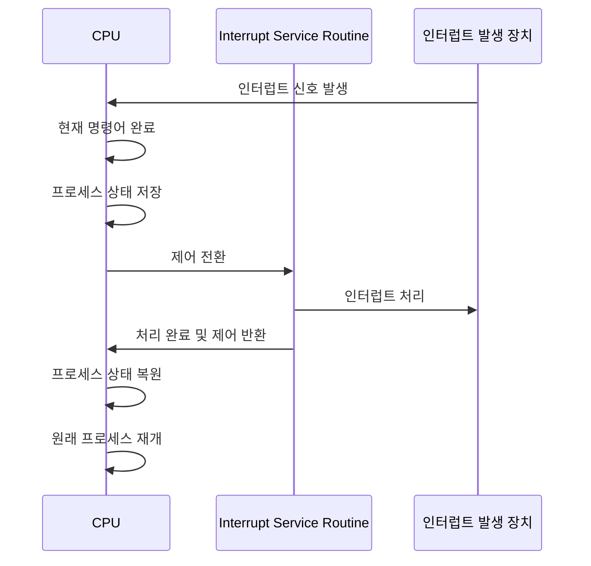
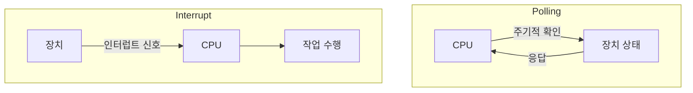
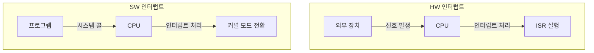
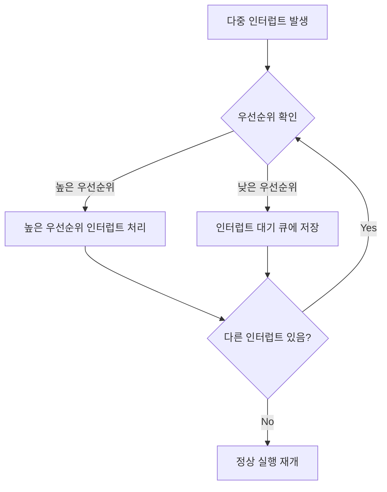

# 인터럽트가 무엇인지 설명해 주세요.
인터럽트는 CPU가 프로그램을 실행하고 있을 때, 특정 이벤트가 발생했음을 CPU에 알리고 처리를 요청하는 메커니즘입니다.
이는 컴퓨터 시스템이 외부 환경의 변화에 실시간으로 대응할 수 있게 해주는 핵심적인 기능입니다.

인터럽트의 주요 특징
1. 비동기성: 인터럽트는 예측할 수 없는 시점에 발생할 수 있습니다.
2. 즉시성: 인터럽트 발생 시 CPU는 현재 작업을 중단하고 즉시 대응합니다.
3. 우선순위: 여러 인터럽트가 동시에 발생할 경우, 우선순위에 따라 처리됩니다.

인터럽트의 중요성
1. 효율성: CPU가 I/O 작업 완료를 기다리지 않고 다른 작업을 수행할 수 있게 합니다.
2. 반응성: 시스템이 외부 이벤트에 신속하게 대응할 수 있게 합니다.
3. 병렬 처리: 여러 장치의 요청을 동시에 처리할 수 있게 합니다.

인터럽트는 CPU가 프로그램을 실행 중일 때, 예기치 않은 상황이나 중요한 이벤트가 발생했음을 알리고 이에 대한 처리를 요청하는 메커니즘입니다.
이는 비동기적으로 발생하며, CPU는 현재 작업을 일시 중단하고 인터럽트를 즉시 처리합니다. 
인터럽트는 시스템의 효율성과 반응성을 높이는 데 중요한 역할을 합니다. 
예를 들어, I/O 작업이 완료되었을 때 인터럽트를 통해 CPU에 알림으로써, CPU가 I/O 완료를 기다리는 동안 다른 작업을 수행할 수 있게 합니다. 또한, 키보드 입력이나 네트워크 패킷 도착과 같은 외부 이벤트에 실시간으로 대응할 수 있게 해줍니다.

## 인터럽트는 어떻게 처리하나요?

1. 인터럽트 발생: 하드웨어 장치나 소프트웨어에서 인터럽트 신호를 CPU로 보냅니다.
2. 현재 명령어 완료: CPU는 현재 실행 중인 명령어를 완료합니다.
3. 프로세스 상태 저장: CPU는 현재 실행 중인 프로세스의 상태(PC, 레지스터 값 등)를 스택에 저장합니다. 이를 '컨텍스트 저장'이라고 합니다.
4. 인터럽트 서비스 루틴(ISR) 실행: CPU는 인터럽트 벡터 테이블을 참조하여 해당 인터럽트의 처리 루틴으로 제어를 전환합니다.
5. 인터럽트 처리: ISR이 실행되어 인터럽트를 처리합니다.
6. 인터럽트 완료 및 제어 반환: ISR 실행이 완료되면 CPU로 제어가 반환됩니다.
7. 프로세스 상태 복원: 저장했던 프로세스의 상태를 복원합니다.
8. 원래 프로세스 재개: 인터럽트 발생 직후의 명령어부터 원래 프로세스의 실행을 재개합니다.

인터럽트 처리는 여러 단계로 이루어집니다. 먼저, 인터럽트가 발생하면 CPU는 현재 명령어를 완료하고 실행 중이던 프로세스의 상태를 저장합니다.
그 다음, 인터럽트 벡터 테이블을 참조하여 해당 인터럽트의 처리 루틴(ISR)으로 제어를 전환합니다. ISR이 인터럽트를 처리한 후, CPU는 저장했던 프로세스 상태를 복원하고 원래 프로세스의 실행을 재개합니다.
이 과정을 통해 시스템은 인터럽트에 신속하게 대응하면서도 기존 프로세스의 실행을 안전하게 유지할 수 있습니다.

## Polling 방식에 대해 설명해 주세요

Polling 방식의 정의와 작동 원리
1. 정의: Polling은 CPU가 주기적으로 장치의 상태를 확인하여 입출력 작업의 완료 여부나 이벤트 발생을 검사하는 방식입니다.
2. 작동 원리
   - CPU가 일정 간격으로 장치의 상태 레지스터를 확인합니다.
   - 장치에 변화가 있으면 그에 따른 처리를 수행합니다.
   - 변화가 없으면 다음 주기까지 대기합니다.

Polling 방식의 장단점
- 장점
  - 구현이 간단합니다.
  - 예측 가능한 방식으로 작동하여 실시간 시스템에 유용할 수 있습니다.
  - 매우 빈번한 이벤트 처리에 효율적일 수 있습니다.
- 단점
  - CPU 자원을 지속적으로 사용하여 효율성이 떨어질 수 있습니다.
  - 이벤트 발생 시점과 확인 시점 사이에 자연이 발생할 수 있습니다.
  - 여러 장치를 동시에 관리하기 어렵습니다.

인터럽트 방식과의 비교
1. CPU 사용: Polling은 CPU가 계속해서 확인 작업을 수행하지만, 인터럽트는 이벤트 발생 시에만 CPU를 사용합니다.
2. 반응 시간: Polling은 확인 주기에 따라 지연이 발생할 수 있지만, 인터럽트는 즉각적인 반응이 가능합니다.
3. 복잡성: Polling은 구현이 단순하지만, 인터럽트는 상대적으로 복잡한 하드웨어와 소프트웨어 구조가 필요합니다.

Polling 방식은 CPU가 주기적으로 장치의 상태를 확인하여 이벤트나 I/O 작업의 완료 여부를 검사하는 기법입니다.
이 방식은 구현이 간단하고 예측 가능한 동작을 보이는 장점이 있습니다. 하지만 CPU 자원을 지속적으로 사영하며, 이벤트 발생과 확인 사이에 지연이 생길 수 있다는 단점도 있습니다.
인터럽트 방식과 비교하면, Polling은 CPU를 더 많이 사용하지만 매우 빈번한 이벤트 처리에 효과적일 수 있습니다. 
반면 인터럽트는 CPU 사용을 줄이고 즉각적인 반응이 가능하지만, 구현이 더 복잡합니다. 실제 시스템에서는 상황에 따라 두 방식을 적절히 조합하여 사용하는 경우가 많습니다.
## HW / SW 인터럽트에 대해 설명해 주세요

1. HW 인터럽트
- 정의: 외부 하드웨어 장치에 의해 발생하는 인터럽트입니다.
- 특징
  - 비동기적으로 발생합니다 (예측 불가능한 시점에 발생)
  - CPU 외부에서 발생하여 인터럽트 라인을 통해 CPU에 전달됩니다.
  - 일반적으로 I/O 장치, 타이머, 전원 관리 등과 관련이 있습니다.
- 예시
  - 키보드나 마우스 입력
  - 디스크 읽기/쓰기 완료
  - 네트워크 패킷 도착
  - 타이머 만료
- 처리 과정
  - 외부 장치가 인터럽트 신호를 발생시킴
  - CPU가 현재 명령어를 완료하고 인터럽트를 확인
  - 해당 인터럽트에 대한 ISR(Interrupt Service Routine)을 실행
2. SW 인터럽트
- 정의: 프로그램 실행 중에 소프트웨어에 의해 의도적으로 발생시키는 인터럽트입니다.
- 특징
  - 동기적으로 발생합니다. (프로그램 실행 순서에 따라 예측 가능)
  - CPU 내부에서 특정 멸령어 실행에 의해 발생합니다.
  - 주로 시스템 콜이나 예외 처리에 사용됩니다.
- 예시
  - 시스템 콜 (예: 파일 열기, 메모리 할당)
  - 0으로 나누기와 같은 예외 상황
  - 디버깅을 위한 브레이크포인트
- 처리 과정
  - 프로그램이 특정 명령어(예: 트랩 명령)을 실행하여 인터럽트 발생
  - CPU가 사용자 모드에서 커널 모드로 전환
  - 해당 시스템 콜이나 예외 처리 루틴 실행
3. 주요 차이점
   - 발생 원인: HW는 외부 장치, SW는 프로그램 내부에서 발생
   - 예측 가능성: HW는 비동기적, SW는 동기적
   - 사용 목적: HW는 주로 I/O 관리, SW는 시스템 서비스 요청이나 예외 처리

하드웨어 인터럽트와 소프트웨어 인터럽트는 발생 원인과 특성에 차이가 있습니다. 
하드웨어 인터럽트는 키보드 입력이나 타이머 만료와 같이 외부 장치에 의해 비동기적으로 발생하며 주로 I/O 관리에 사용됩니다.
반면 소프트웨어 인터럽트는 시스템 콜이나 예외 상황과 같이 프로그램 실행 중에 의도적으로 발생시키는 것으로, 동기적으로 발생하며 시스템 서비스 요청이나 예외 처리에 주로 사용됩니다.
하드웨어 인터럽트는 예측 불가능한 시점에 발생하여 ISR을 통해 처리되고, 소프트웨어 인터럽트는 프로그램 실행 순서에 따라 예측 가능하며 커널 모드로의 전환을 통해 처리됩니다.
## 동시에 두 개 이상의 인터럽트가 발생하면, 어떻게 처리해야 하나요?

1. 우선순위 기반 처리
   - 각 인터럽트에 우선순위를 할당합니다.
   - 높은 우선순위의 인터럽트를 먼저 처리합니다.
   - 낮은 우선순위의 인터럽트는 대기 상태로 둡니다.
2. 인터럽트 중첩
   - 현재 처리 중인 인터럽트보다 높은 우선순위의 인터럽트가 발생하면, 현재 인터럽트 처리를 중단하고 새로운 인터럽트를 처리합니다.
   - 이를 위해 인터럽트 처리 중에도 다른 인터럽트를 허용하는 설정이 필요합니다.
3. 인터럽트 마스킹
   - 중요한 인터럽트 처리 중에는 일시적으로 다른 인터럽트를 막습니다.
   - 이를 통해 중요한 작업의 원자성을 보장할 수 있습니다.
4. 인터럽트 벡터 테이블 사용
   - 각 인터럽트 유형에 대한 처리 루틴의 주소를 저장하는 테이블을 사용합니다.
   - 빠르게 적절한 처리 루틴으로 분기할 수 있습니다.
5. 소프트웨어 큐 사용
   - 동시에 발생한 인터럽트들을 소프트웨어 큐에 저장합니다.
   - 우선순위에 따라 큐에서 인터럽트를 꺼내어 순차적으로 처리합니다.

처리 과정
1. 여러 인터럽트 동시 발생
2. 우선순위 확인
3. 가장 높은 우선순위의 인터럽트 처리
4. 처리 완료 후 다음 우선순위의 인터럽트 확인 및 처리
5. 모든 인터럽트 처리 완료 시 정상 실행 재개

동시에 여러 인터럽트가 발생할 경우, 우선순위 기반의 처리 방식을 주로 사용합니다. 
각 인터럽트에 우선순위를 할당하고, 높은 우선순위의 인터럽트를 먼저 처리합니다. 인터럽트 중첩을 통해 현재 처리 중인 인터럽트보다 더 높은 우선순위의 인터럽트가 발생하면 즉시 전환할 수 있습니다. 
또한, 인터럽트 마스킹을 사용하여 중요한 작업 중에는 다른 인터럽트를 일시적으로 차단할 수 있습니다. 
실제 구현에서는 인터럽트 벡터 테이블을 사용하여 빠르게 적절한 처리 루틴으로 분기하고, 소프트웨어 큐를 활용하여 동시 발생한 인터럽트들을 관리합니다.
이러한 방식으로 시스템은 여러 인터럽트를 효율적으로 처리하면서도 중요한 작업의 원자성과 시스템의 안정성을 유지할 수 있습니다.